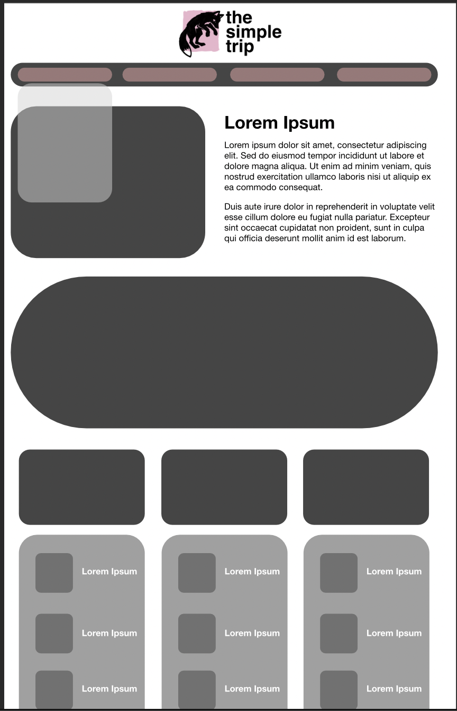

# Trabalho Prático - Semana 04

Dessa vez, vamos escolher uma proposta de projeto para trabalhar.

Nessa atividade, você deverá montar a página inicial do projeto escolhido, a organização do HTML aplicando semântica correta e uso aprimorado do CSS. Leia o enunciado completo no Canvas para mais detalhes.

**IMPORTANTE:** Você deve trabalhar e alterar apenas arquivos dentro da pasta **`public`**. Deixe todos os demais arquivos e pastas desse repositório inalterados. **PRESTE MUITA ATENÇÃO NISSO.**

## Informações Gerais

- Nome: Rodrigo Lage da Costa
- Matricula: 907987
- Proposta de projeto escolhida: A ideia é ser um projeto sobre viagens, sendo a Entidade Primaria: Vibes de Viagem (Museus, Praias, Festas, Aventura...) e Entidade Secundaria: Lugares (Ouro Preto, Caraiva, Floripa, Interlaken...).

- Breve descrição sobre seu projeto:
The Simple Trip (nome do site_ é uma ferramenta de planejamento de viagens, construída para brasileiros que querem viajar bem, mas sentem que o processo é confuso ou intimidador.

## Print do(s) wireframe(s) criado
> Sugestão, use o Excalidraw para isso. Utilize esse [template básico](https://excalidraw.com/#json=LU-8hwcQEwzk11FwO8Opo,qPU9K6cNUEzlXzwOuKMIlQ) para você começar. 

<<  COLOQUE A IMAGEM AQUI >>

## Print da home-page criada

<<  COLOQUE A IMAGEM AQUI >>
